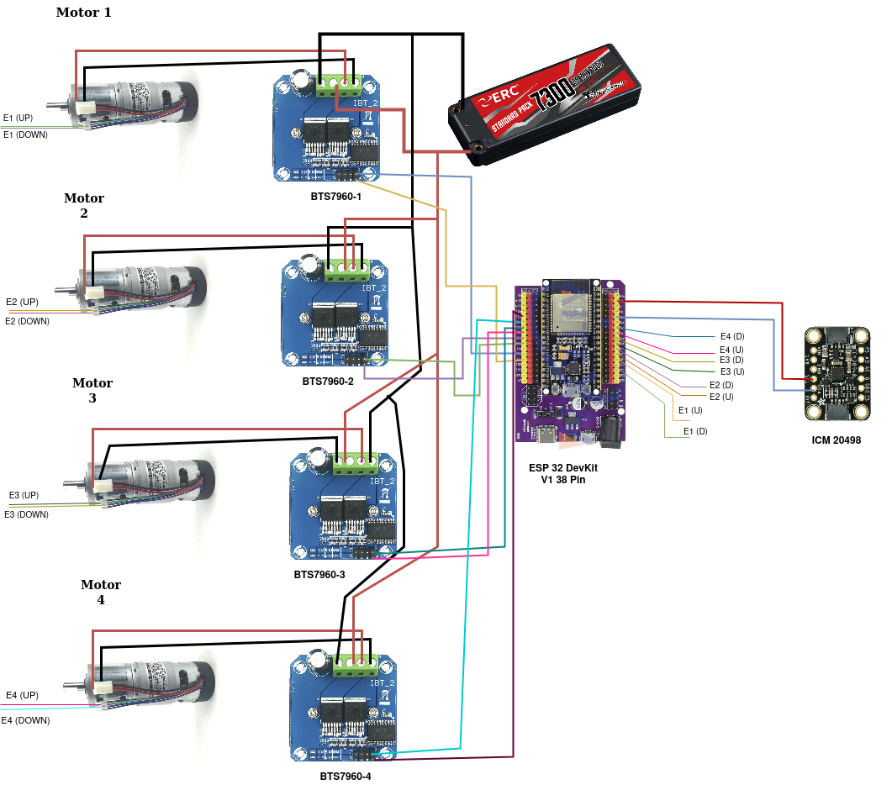

# Mecanum Wheel Mobile Robot (MWMR)

This project has been used for Final Year Project (FYP) for the last year of the semester from 2023 to 2024. 

The title for my (FYP) is **"DEVELOPMENT OF AN INDOOR AUTONOMOUS ROBOT USING ULTRASONIC SENSOR- BASED NAVIGATION"**.Therefore feel free to go through the research paper in the reference below.


## Requirement

Setup | Description | Link
:----------: | :----: | :----------:
**Ubuntu**|`Focal Fossa (20.04)`  | https://releases.ubuntu.com/focal/
**Ros 1** |`Noetic` | https://wiki.ros.org/noetic/Installation
**Vs Code** | `snap`| https://code.visualstudio.com/download
**Plaftform IDE**| `extension`| https://platformio.org/platformio-ide

Shortcut prompt command for the ROS1
`````
sudo sh -c 'echo "deb http://packages.ros.org/ros/ubuntu $(lsb_release -sc) main" > /etc/apt/sources.list.d/ros-latest.list' && sudo apt install curl -y && curl -s https://raw.githubusercontent.com/ros/rosdistro/master/ros.asc | sudo apt-key add - && sudo apt update && sudo apt install ros-noetic-desktop-full -y
`````


If you want to install the VS Code in the **Raspberry Pi** , run the command below:


`````
curl -L https://aka.ms/linux-arm64-deb > code_arm64.deb
sudo apt install ./code_arm64.deb
``````

## Hardware Configuration

All the pins in connected with **EPS32 DevKit V1 38 Pins** please refer to the picture below:




### Motor Pins Configuration

This project use  [IG42e-24K](https://my.cytron.io/p-12v-248rpm-10kgfcm-planetary-dc-geared-motor-with-encoder) motor with the specs of 12V 248RPM 10kgfcm and 120 ppr for the encoder. For the driver we use the [BTS7960](https://www.google.com/url?sa=t&source=web&rct=j&opi=89978449&url=https://www.handsontec.com/dataspecs/module/BTS7960%2520Motor%2520Driver.pdf&ved=2ahUKEwiyi_33vpaFAxUm2DgGHY61DuQQFnoECCAQAQ&usg=AOvVaw0IWVR-1gosuocPG1Wmpnxk).

Motor | RPWM | LPWM | Encoder 
:----------: | :----: | :----------:| :----------: 
| Motor 1 |12 |13 |15,2
| Motor 2 |27|28 |0,4
| Motor 3 |33 |25 |16,17
| Motor 4 |32 |35 |5,18

*Connect all the **L_EN** and **R_EN** pin with the **5V pins** to the microcontroller.*


